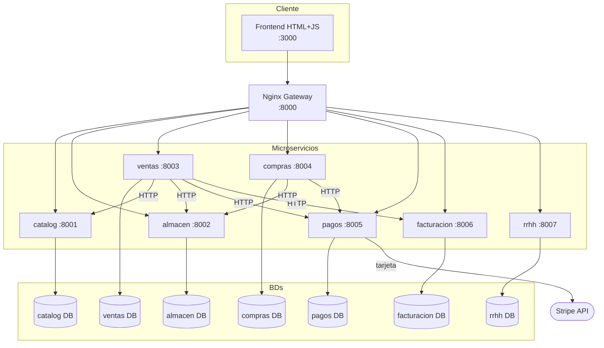

# Arquitectura

## Diagrama (Mermaid)

## Decisiones de diseño

### Por qué un BD por servicio
Cada servicio es desplegable independientemente. Si compartiéramos BD, una migración del servicio A podría romper al B.

### Por qué orquestación en Ventas (no coreografía/eventos)
El alcance del MVP no justifica el broker. El endpoint `POST /ventas` hace el orquestaje sincronicamente. La compensación (revertir movimientos) la maneja el mismo servicio.

### Por qué tabla `agencias` local en cada servicio
Las agencias son datos de lookup que cambian raras veces. Replicarlas evita una llamada HTTP en el camino crítico de cada operación. El seed se ejecuta en el lifespan del servicio y es idempotente.

### Numeración de facturas
Cada agencia mantiene su propio contador (`ContadorFactura.ultimo`). El formato es `<codigo_agencia>-<correlativo 8 dígitos>`, ej `A001-00000001`. La operación debe ser atómica (SELECT FOR UPDATE) para evitar duplicados bajo carga.

### Stripe en modo test
Cuando `metodo == "tarjeta"`, Pagos crea un PaymentIntent y devuelve el `client_secret`. El frontend (en una integración real) usaría Stripe Elements para confirmarlo. Para el MVP el webhook actualiza el estado.

### Sin auth — por qué
Excluido explícitamente por el docente. Toda llamada se considera confiable y proviene del gateway o del frontend en localhost.
