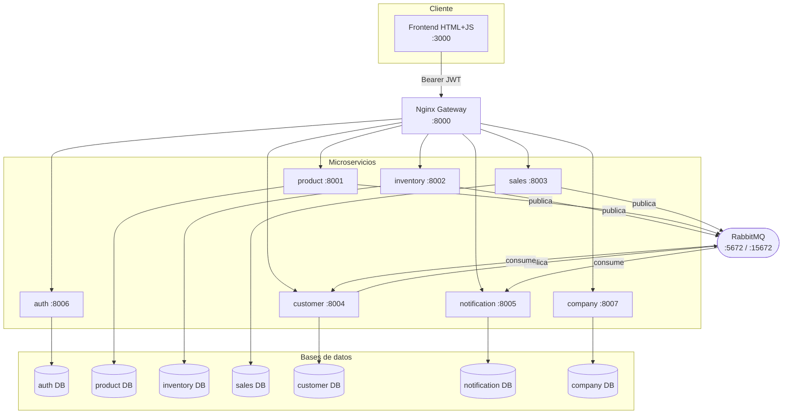

# Arquitectura

## Diagrama



## Flujos principales

```
Login:
  Frontend → POST /auth/login → auth → JWT (sub=UUID, rol, sucursal_id)
  Auth valida user.activo == True (los desactivados no obtienen token).

Venta:
  Frontend → GET  /customers?ci_nit=... (autocompletado opcional del cliente)
  Frontend → POST /sales  con metodo_pago ∈ {efectivo, tarjeta, transferencia}
    sales → GET /products/{id}   (precio)
    sales → POST /inventory/...  (salida de stock)
    sales → publica SaleCompleted → RabbitMQ
    RabbitMQ → notification (registra notificación)
    RabbitMQ → customer (acumula puntos)

Transferencia de inventario:
  Frontend → POST /inventory/transfer → inventory
    inventory → salida en agencia origen (atómica)
    inventory → entrada en agencia destino (atómica)
    inventory → publica TransferCompleted → RabbitMQ

Alta de producto:
  Frontend → POST /products  (sin código)
    product → genera SKU correlativo por categoría (LAC006, CAR007, …)
    product → publica ProductCreated → RabbitMQ
```

## Decisiones de diseño

### JWT — autenticación stateless
Cada request lleva `Authorization: Bearer <token>`. El gateway pasa el token sin verificarlo; cada servicio lo verifica con la `SECRET_KEY` compartida vía variable de entorno. El payload incluye `sub` (UUID del usuario), `rol` (Administrador | Vendedor) y `sucursal_id`. El login además rechaza usuarios con `activo=False`.

### Una BD por servicio
Cada servicio es desplegable independientemente. Comparten solo contratos de API (JSON), nunca tablas ni esquemas. Una migración en un servicio no afecta a los demás.

### Comunicación asíncrona con RabbitMQ
Eventos de negocio (venta completada, stock bajo, producto creado) se publican al exchange `events` (topic). Los consumidores declaran sus colas propias. Esto desacopla a los servicios en el camino no crítico.

### UUIDs fijos en seed data
Los seeds de product, company e inventory usan UUIDs constantes coordinados entre sí (`a000000X` para productos, `b000000X` para empresas, `c000000X` para sucursales). Esto permite que el seed de inventory referencie productos e agencias sin hacer llamadas HTTP en el arranque.

### Rol-based UI
El frontend lee el claim `rol` del JWT al hacer login y oculta tabs según el rol:
- **Administrador**: Productos, Inventario, Empresa, Reportes
- **Vendedor**: Ventas (solo su sucursal, filtra por `sucursal_id` del token)

### Tabla `agencias` local en inventory
Inventory mantiene su propia tabla de agencias con los mismos UUIDs que el servicio company. Esto evita una llamada HTTP en el camino crítico de cada movimiento de stock. El seed es idempotente.

### SKU autogenerado por categoría
El campo `codigo` de `POST /products` es opcional. Si se omite, el backend genera el siguiente correlativo según un mapa fijo de prefijos por categoría (LAC, CAR, ABA, BEB, LIM, HIG, PAN). Para categorías nuevas el fallback son las primeras 3 letras normalizadas (sin acentos, mayúsculas). Esto garantiza que los códigos sean uniformes y secuenciales sin trabajo manual del operador.

### `metodo_pago` persistido en ventas
La tabla `ventas` incluye `metodo_pago String(20)` con default `"efectivo"`. Acepta los valores `efectivo | tarjeta | transferencia`. Necesario para el reporte consolidado por método de pago (sin este campo el reporte siempre mostraba Bs 0 en Efectivo/Tarjeta).

### Cross-service lookup desde el frontend
El frontend hace `GET /customers?ci_nit=...` o consulta el datalist de clientes al hacer una venta, pero NO existe FK desde `sales.ventas` hacia `customers`. La venta guarda nombre y CI/NIT como strings sueltos — es responsabilidad del frontend usar los datos del customer service como sugerencia. Esto mantiene el desacople entre servicios.
